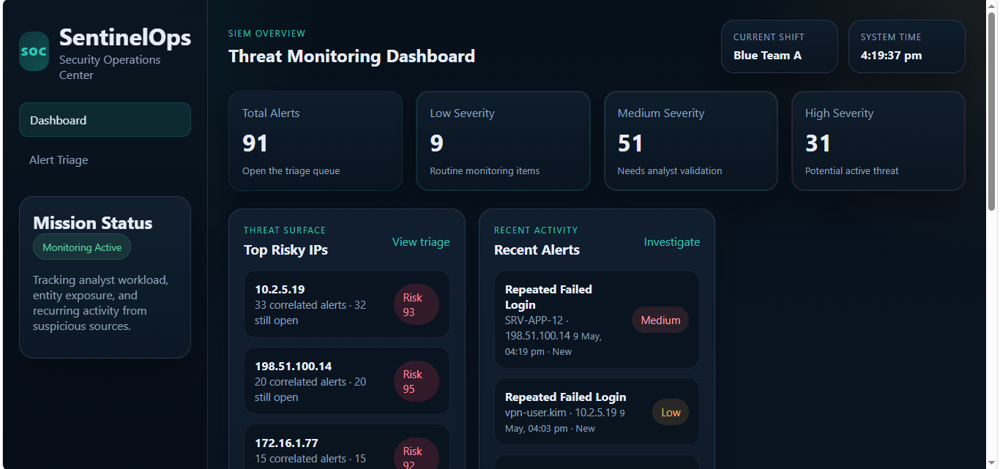
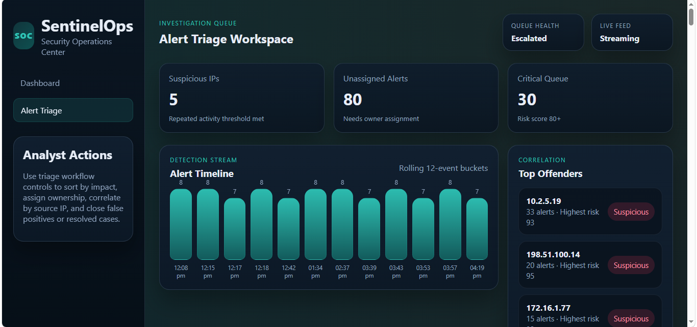

# 🛡️ SOC Dashboard – SIEM Simulator

## 📌 Overview

This project is a **Security Operations Center (SOC) Dashboard Simulator** designed to replicate core SIEM (Security Information and Event Management) workflows. It demonstrates how security analysts monitor, triage, and respond to alerts in a real-world SOC environment.

The system uses simulated log data to generate alerts and enables tracking of incidents across their lifecycle — from detection to resolution.

---

## 🎯 Objectives

* Simulate real-world SOC operations
* Demonstrate alert triage and incident handling
* Implement basic correlation and risk scoring
* Showcase foundational blue-team cybersecurity skills

---

## ⚙️ Features

* 📥 **Simulated Alert Ingestion** – Loads alerts from log data
* 🚨 **Alert Management** – View and track alerts dynamically
* 🔄 **Incident Lifecycle Tracking** – New → In Progress → Closed
* 🎯 **Risk-Based Prioritization** – Alerts categorized by severity
* 🔗 **Basic Correlation Engine** – Detect repeated/suspicious IP activity
* 👨‍💻 **Analyst Assignment** – Assign alerts to analysts
* 💾 **Local Persistence** – Uses localStorage to retain state

---

## 🧠 SOC Workflow Simulated

This project models a simplified SOC pipeline:

1. **Alert Ingestion** – Logs are processed, and alerts are generated
2. **Triage** – Alerts are reviewed and prioritized
3. **Investigation** – Basic correlation (e.g., repeated IP detection)
4. **Response** – Alerts are assigned and resolved
5. **Closure** – Incident status updated and tracked

---

## 🔐 Detection Logic (Basic)

* Repeated IP addresses are flagged as suspicious
* Alerts are assigned severity levels (Low, Medium, High)
* Risk scoring helps prioritize analyst focus

> Note: This is a simulation and does not use real-time detection engines.

---

## 🛠️ Tech Stack

* **Frontend:** HTML, CSS, JavaScript
* **Architecture:** Modular JavaScript (separated logic files)
* **Data Handling:** JSON-based logs
* **Storage:** Browser localStorage

---

## 📸 Screenshots

### Dashboard View


### Alert Management


---

## 🚀 Getting Started

### 1. Clone the repository

```bash
https://github.com/poojanoochila/soc-dashboard-siem-simulator
```

### 2. Open the project

Simply open `index.html` in your browser.

---

## ⚠️ Limitations

* No backend or database integration
* No real-time log ingestion
* Detection logic is simplified
* Not connected to real SIEM tools

---

## 🔮 Future Improvements

* Backend integration (Node.js / Flask)
* Real log ingestion (Sysmon, Windows Event Logs)
* Advanced detection rules engine
* MITRE ATT&CK mapping
* User authentication & role-based access control (RBAC)
* Integration with SIEM tools (Splunk / ELK)

---

## 📚 Learning Outcomes

Through this project, the following concepts were explored:

* SOC operations and workflows
* Incident triage and response lifecycle
* Alert prioritization and risk scoring
* Basic event correlation techniques

---

## 🤝 Contribution

Contributions are welcome. Feel free to fork the repository and submit pull requests.

---

## 📄 License

This project is for educational purposes.

---

## 👩‍💻 Author

Developed as part of cybersecurity learning and SOC analyst skill development.
